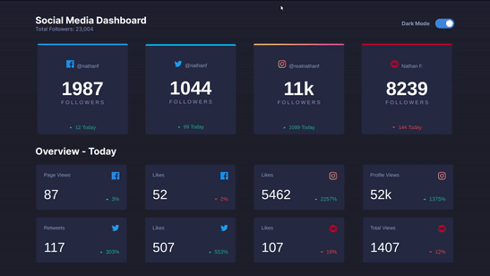

<h1 align="center">Social Media Dashboard</h1>
<h3 align="center">Controll all your activities in one place!</h3>

---



## 📜 About the project
This project is a layout challenge that can be found [here](https://www.frontendmentor.io/challenges/social-media-dashboard-with-theme-switcher-6oY8ozp_H). I've used this layout to improve my ReactJS skills and to learn some things about themes and dark mode with React Context.

## 🚀 Deploy
You can access the aplication following this link: https://social-media-dashboard-659anfpjj.now.sh/

## 📑 Technologies
- [ReactJS](https://pt-br.reactjs.org/)
- [React Router DOM](https://reactrouter.com/web/guides/quick-start)
- [Styled Components](https://styled-components.com/)
- [ESLint](https://eslint.org/)
- [Prettier](https://prettier.io/)
- [Editor Config](https://editorconfig.org/)

## 💻 Getting Started
### Requirements
- [yarn](https://yarnpkg.com/) or [npm](https://www.npmjs.com/)

### Install
```bash
# Clone repository
$ git clone https://github.com/lcastrof/social-media-dashboard

# Access directory
$ cd vuttr-api

# Install dependencies
$ yarn install
```

### Run
```bash
$ yarn start
```
---
Developed by Lucas de Castro Fernandino
